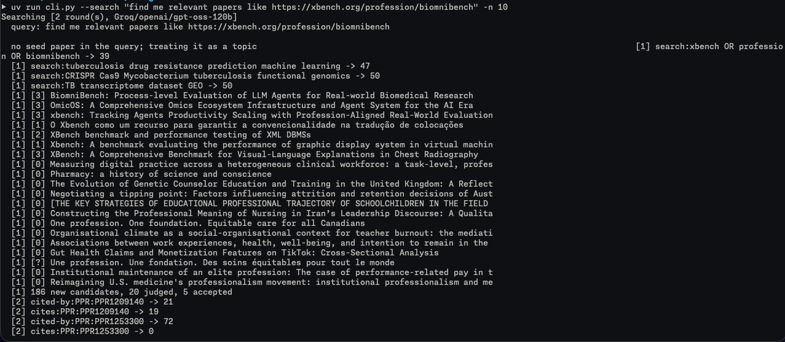
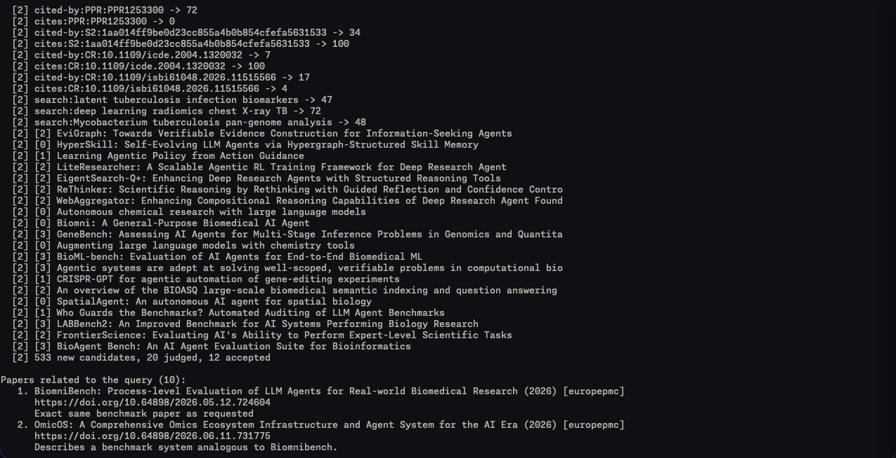

# tb-agentic-search





Three capabilities, with every LLM call going through
[Biomni](https://github.com/snap-stanford/Biomni) to a model you serve yourself
— vLLM on the cluster, or Ollama locally (see
[Serving the model](#serving-the-model-vllm-on-unity)). No hosted API, no key.

- **Retrieval** (`--search`) — give it a request such as "find me relevant papers
  like this paper <paper-url>". It resolves the seed paper on Europe PMC,
  Semantic Scholar or Crossref, gathers candidates from the seed's references,
  the papers citing it and keyword searches, and has the LLM score them. Papers
  it accepts seed the next round, and in this default path every returned paper
  comes straight from a source API, so none can be invented. `--agent` swaps the
  small per-paper calls for the Biomni A1 agent, whose own tool calls do the
  retrieval.
- **Screening** — hand it a folder of documents (PDF or plain text) and it
  returns an assessment per document: `tb_related`, a 0–3 `relevance`, paper
  type, drugs, genes/variants, methods, datasets, and an `evidence` quote that
  is checked against the text (`evidence_verified`).
- **Resistance prediction from VCFs** (`--cohort`, `--predict`) — ingest the
  BIG-TB isolate VCFs, and for a given drug predict `resistant` /
  `not_resistant` / `unknown` with a reasoning trace. Calls are scored against
  the phenotypic DST labels, and each trace is graded against the variants the
  model was actually shown.

Serving the model ourselves is what makes the reasoning traces usable: a vLLM
server started with a reasoning parser returns the model's thinking separated
from its answer, and every prediction stores that trace verbatim beside the
variants it was shown. It is also what gives the A1 agent a tool-calling
backend that costs GPU hours rather than per-token billing.

Screening has two modes:

- **light** (default) — one small LLM call per document (~1.5k tokens).
- **`--agent`** — the full Biomni A1 agent tool loop. A1's system prompt is
  ~35k tokens, so the server needs a context window well past that
  (`--max-model-len 65536`) and tool calling enabled.

## Setup

```bash
uv sync
cp .env.example .env   # optional: everything in it has a default
```

Every mode needs a model server to call, and nothing in `.env` is required to
reach one: the defaults are `Qwen/Qwen3-32B` at `http://localhost:8000/v1`, so
`--base-url` (or `VLLM_BASE_URL`) is all that changes when the server lives on
a compute node. `SEMANTIC_SCHOLAR_API_KEY` and `CROSSREF_MAILTO` are optional:
both sources
answer without them, only slower (`CROSSREF_MAILTO` is just an email address and
puts requests in Crossref's faster "polite" pool).

## Resistance prediction from VCFs

The dataset comes from two files in `data/cleaned_vcf_paths/`:
`master_resistance_table.csv` (phenotypic DST, R/S per isolate per drug) and
`big_tb_file_paths.txt` (the BIG-TB VCF paths on the cluster). They join on the
table's `New_ID` column, which matches the VCF filename stem for all 17,942
BIG-TB isolates, giving a labelled dataset per drug — 17.6k isolates for
rifampicin, 17.4k for isoniazid, down to a few dozen for the rarely tested
drugs.

Variants are named without needing an annotated VCF. Each position is looked up
in `data/h37rv_genes.tsv` (NCBI's feature table for H37Rv, NC_000962.3) to get
the gene, the codon number, or a promoter offset, and the codon is then
translated against the reference in `data/h37rv.fna.gz` to get the actual
protein consequence. So `761155 C>T` is presented as `rpoB S450L`, `761156 G>A`
as `rpoB S450S synonymous`, `1673425 C>T` as `fabG1 -15 (promoter)` and a 1 bp
deletion in pncA as a frameshift. When the VCF carries its own `ANN`/`CSQ`
field, that annotation is used instead.

Naming the protein change matters more than it looks: shown only "rpoB codon
453", the model calls any hotspot codon resistant, because it cannot tell a
silent change from a missense one. Shown "rpoB S450S synonymous", it correctly
rules the variant out.

Because the reference is loaded anyway, every record's `REF` is checked against
H37Rv. A run that reports mismatches was called against a different reference or
has shifted coordinates, and its gene and codon assignments cannot be trusted.

Variants are then filtered to the genes the WHO catalogue grades for that drug,
split into tier 1 (established mechanism) and tier 2 (secondary).

**Each trace is checked, not just read.** Every prediction is stored next to the
variants it was shown, so three things are verified mechanically:

| check | what it catches |
| --- | --- |
| `variants_resolve` | the model cited a variant that was never in the VCF |
| `genes_on_panel` | the model reasoned from a gene not graded for that drug |
| `call_grounded` | a `resistant` call that rests on no variant at all |

`tier1_support` additionally records whether the call rests on a tier 1 gene
rather than only a secondary one. A trace is `valid` when nothing in it was
invented or self-contradictory — accuracy and trace validity are reported
separately, because a run can be accurate and still be reasoning from variants
that were not there.

```bash
# the labelled dataset size per drug; no LLM calls
uv run cli.py --cohort

# predict, on a balanced sample, with the VCFs mounted locally
uv run cli.py --predict isoniazid --limit 40 --balance --vcf-root /path/to/vcfs
uv run cli.py --predict rifampicin --limit 100 --balance --seed 1
```

The BIG-TB VCFs live on the cluster, so `--vcf-root` points at wherever they
actually are; without it the recorded cluster path is used as-is. A run prints
one line per isolate (the call, whether it matched the DST, and any trace
problem) and ends with accuracy, sensitivity, specificity, PPV/NPV, the
confusion matrix and the trace rates. `tb_resistance_<drug>.json` holds every
prediction with its variant list, reasoning and trace grade.

## Serving the model (vLLM on Unity)

The model runs on our own hardware, which is what puts the model choice, the
reasoning settings and the response format under our control — and lets the
server hand back the model's thinking as its own field instead of leaving it
mixed into the answer.

Biomni has two backends that serve a model locally, and both drive the A1
agent, so `--agent` works either way:

| `--source` | what it is | reasoning traces |
| --- | --- | --- |
| `Custom` (default) | any OpenAI-compatible server, i.e. `vllm serve` | separated into `reasoning`, captured per prediction |
| `Ollama` | a pulled Ollama model on its own port | only what the model leaves in `<think>` tags |

`Custom` is the one to use on the cluster. The default model is
`Qwen/Qwen3-32B`: vLLM serves it with a `qwen3` reasoning parser *and* with
tool calling, and biomni reaches it as an ordinary OpenAI-compatible model,
which is what A1 needs to call its tools — all three at once, which not every
model manages.

`scripts/serve_vllm_unity.sbatch` starts the server in its own Slurm job:

```bash
sbatch scripts/serve_vllm_unity.sbatch
tail -f logs/vllm-<jobid>.out    # prints the exact --base-url to use
```

(The job's defaults — partition, GPU count, the venv holding vLLM — are set at
the top of that file and will want matching to your Unity allocation.)

It runs, in effect:

```bash
vllm serve Qwen/Qwen3-32B --port 8000 \
    --reasoning-parser qwen3 \
    --enable-auto-tool-choice --tool-call-parser hermes \
    --max-model-len 65536
```

`--reasoning-parser` is what separates the thinking into the response's
`reasoning` field ([vLLM
docs](https://docs.vllm.ai/en/stable/features/reasoning_outputs/)); the parser
name has to match the model family. `--enable-auto-tool-choice` is what lets
the A1 agent do its tool calling against this server, and `--max-model-len` has
to clear A1's ~35k-token system prompt for `--agent` to work at all.

Then point any mode at it. biomni runs here, in this process, and knows the
inference engine only by URL:

```bash
# resistance prediction, with thinking captured per isolate
uv run cli.py --predict rifampicin --limit 40 --balance \
    --base-url http://gpu042:8000/v1 --model Qwen/Qwen3-32B \
    --reasoning-effort high

# from a laptop, through a tunnel: ssh -N -L 8000:gpu042:8000 unity.rc.umass.edu
uv run cli.py --predict isoniazid --base-url http://localhost:8000/v1 ...

# the A1 agent tool loop against the same server
uv run cli.py --search "papers like <url>" --agent --base-url http://gpu042:8000/v1
```

`--base-url` is biomni's `Custom` source for the plain per-call screener and
for the A1 agent alike, and no API key is involved. Before anything else runs,
the endpoint is pinged and its model list checked, so a job that has not come up
yet — or a model id that is not the one being served — fails immediately
instead of mid-run (`--source Ollama` is checked the same way, against
`ollama`'s own list of pulled models).

A local server has no rate limit, so there is nothing to wait out; a request
that fails on a busy or restarting server is retried twice, while one that fails
on context length is not, because it would fail again identically.

`--reasoning-effort` goes out as the request's `reasoning_effort`, which vLLM
maps onto the chat template's thinking switch. It is recorded in the output
JSON, because traces are only comparable across runs at the same effort.

**What ends up in the traces.** Each prediction carries two: `reasoning`, what
the model wrote into its answer, and `reasoning_trace`, the thinking the server
separated out. They can disagree, and the second is the one that shows how the
call was actually reached, so it is what the biological-validity read-through
works from. The run summary reports how many calls came with thinking attached
and the median length; a model served without a reasoning parser yields empty
traces and the summary says so.

With `reasoning_content` being the field's older spelling, and langchain's
`ChatOpenAI` dropping both as non-standard, `tb_search/screening.py` subclasses
it to keep them — otherwise the traces never reach us at all.

## Usage

**Screening local documents**

```bash
uv run cli.py                        # screens ./papers, or ../papers when ./papers is absent
uv run cli.py ../papers               # any directory or single PDF/text file
uv run cli.py -o out.json             # default output: tb_verdicts.json
uv run cli.py --agent                 # full A1 agent loop instead (needs a big context window)
uv run cli.py --gold eval/screening_gold.json   # plus accuracy against hand labels
```

**Retrieval**

```bash
uv run cli.py --search "find me relevant papers like this paper https://www.biorxiv.org/content/..."
uv run cli.py --search "..." -n 20 -o found.json        # at most 20 papers, most relevant first
uv run cli.py --search "..." --sources europepmc        # one literature source only
uv run cli.py --search "..." --sources semanticscholar,crossref
uv run cli.py --search "..." --rounds 3 --budget 10     # more rounds, fewer LLM calls per round
uv run cli.py --search "..." --agent --verbose          # the Biomni A1 agent instead
```

Candidates are ranked by structure, not by text: a paper reached by several
routes (both reference lists and a keyword search, say) is scored before one a
single search turned up. The LLM then gives it the 0–3 relevance.

**Evaluation**

```bash
uv run cli.py --eval-retrieval "https://www.biorxiv.org/content/..."
uv run cli.py --eval-retrieval "https://..." --sources europepmc   # score one source
```

A search run echoes each lookup as it goes (the round number in brackets),
then each assessed paper with its 0–3 relevance, then the papers it settled on:

```
Searching [2 round(s), Custom/Qwen/Qwen3-32B]
  query: find me relevant papers like this paper https://...

  seed: BIG-TB: A benchmark for ... (2026) [PPR:PPR1226747]
  [1] cited-by:PPR:PPR1226747 -> 53
  [1] search:rifampicin katG mutation -> 25
  [1] [3] Benchmarking the translational potential of AI-based drug-resistance ...
  [1] 148 new candidates, 8 judged, 4 accepted

Papers related to the query (8):
   1. TB-Bench: A Systematic Benchmark of ... (2026) [europepmc]
      https://doi.org/10.64898/2026.04.08.717138
      Provides a TB drug resistance benchmark similar to BIG-TB.
```

## How a run flows

Both modes enter through `cli.py`, which parses flags, loads `Settings` from
`.env` and picks a path. Everything below the CLI is plain Python. In the
default paths the model only plans queries and judges text; under `--agent` it
also drives the retrieval tools and its reply is parsed into rows.

**Screening (the default mode)**

```
cli.py
  load_settings          config.py      .env -> Settings
  resolve_input          documents.py   the directory or single file to read
  collect_docs           documents.py   every PDF/text under it
  check_connection       screening.py   the server's model list + a 1-token call, so a server that is down fails here
  build_screener         screening.py   biomni.llm.get_llm -> chat model
  assess_documents       assess.py      one model call per document
    section_excerpt      documents.py   opening + methods + conclusion
    assess               assess.py      ASSESS_PROMPT -> one JSON object
    parse_assessment     verdicts.py    salvage that JSON from prose or code fences
    normalize_assessment assess.py      quote checked against the text, facets, abstention
  write_results          report.py      console lines + tb_verdicts.json
```

**Retrieval (`--search`, and `--eval-retrieval` which wraps it)**

```
cli.py run_discovery
  build_source           sources.py     Europe PMC / Semantic Scholar / Crossref, or Combined
  discover               discovery.py   repeats --rounds times:
    source.resolve       sources.py     seed paper from a URL/DOI; with no link, the query is the topic
    generate_queries     discovery.py   the LLM writes 3 queries, each from a different angle
    lookup               sources.py     references + citations of the frontier, then every query,
                                        sent to every selected source and merged by DOI
    source.hydrate       sources.py     batch-fetch the abstracts
    rank                 discovery.py   by Candidate.support: routes that reached it, then citations
    assess               assess.py      the top --budget papers, 0-3 relevance, 2+ accepted
    next round           discovery.py   the top 5 accepted papers seed the next round
  discovered_rows        report.py      rows -> tb_papers.json
```

`--agent` replaces the model step, not the pipeline: screening hands document
batches to A1, and `--search --agent` runs A1 once and reads the paper list out
of its reply (`retrieval.py`). `--eval-retrieval` wraps `discover()`: it hides
the seed's reference list, runs the same loop, and reports recall@10/25/50/100
against that list (`evaluate.py`).

## How it uses Biomni

Biomni supplies the model and the optional agent; the pipeline around them is
this repo's, including every prompt (`prompts.py`). The touchpoints are few:

| Biomni piece | Where | Used for |
| --- | --- | --- |
| `biomni.llm.get_llm` | `screening._chat_model` | the chat model on the Ollama branch; an OpenAI-compatible server is built here instead, so the reasoning field survives |
| `biomni.config.default_config` | `build_screener`, `build_agent` | temperature, model and provider; A1 forwards `llm`/`source` but not `temperature` |
| `biomni.agent.A1` | `screening.build_agent` | the `--agent` path: tool loop, tool retriever, data-lake switch |
| `agent.go(prompt)` | `screening.classify_documents_agent` | screening in batches of `--batch-size` documents |
| `agent.go_stream(prompt)` | `retrieval._run_streamed` | search step by step, so its tool calls can be echoed |

Five details are easy to get wrong, which is why the code spells them out:

- The source is always passed explicitly. Biomni's auto-detection sees the
  slash in a HuggingFace id like `Qwen/Qwen3-32B` and would route it to Ollama
  on its own. `Custom` is the branch that points langchain at our server; A1
  takes `base_url` too, so the agent's tool calling runs against it.
- The endpoint is copied into the environment (`BIOMNI_CUSTOM_BASE_URL`,
  `BIOMNI_CUSTOM_API_KEY`) before `A1` is built, because Biomni reads it from
  there, not from our `Settings`.
- A1 builds its own chat model, so `build_agent` replaces `agent.llm` with the
  reasoning-keeping one afterwards; it stays a `ChatOpenAI` subclass because A1
  calls `with_structured_output` on it.
- `expected_data_lake_files=[]` (not `None`) is what tells A1 to skip its
  tens-of-GB data-lake download; `--data-lake` turns it back on.
- `timeout_seconds` comes from `BIOMNI_TIMEOUT_SECONDS` (default 600) and is
  passed only to A1.

A1's system prompt is ~35k tokens, against ~1.5k for one light screening call,
so the default paths avoid A1 entirely: a sweep over thousands of isolates is
not worth 20x the prefill. Where a call can still fail, `retry_transient`
retries a busy or restarting server twice, and a failure is reported per
document or per lookup instead of ending the run.

## Flags

| flag | meaning |
| --- | --- |
| `input` (optional) | Directory or file to screen; defaults to `./papers`, else `../papers` |
| `--search QUERY` | Retrieval request; typically names a seed paper by URL/DOI. Output: `tb_papers.json` |
| `--eval-retrieval SEED` | Recall of SEED's held-out reference list. Output: `eval_retrieval.json` |
| `-n`, `--top` | `[--search]` Upper bound on papers returned, most relevant first (default 10) |
| `--sources` | `[--search]`, `[--eval-retrieval]` Literature sources to query and merge, comma-separated, from `europepmc`, `semanticscholar`, `crossref` (default all three) |
| `--rounds` | `[--search]` Discovery rounds (default 2) |
| `--budget` | `[--search]` Papers the LLM assesses per round (default 20) |
| `--gold JSON` | `[screening]` Hand labels `{filename: true/false}`; prints accuracy |
| `--cohort` | Join the resistance table to the listed VCFs; per-drug dataset sizes. Output: `tb_cohort.json` |
| `--predict DRUG` | Predict resistance to DRUG from each isolate's VCF, with a checked trace. Output: `tb_resistance_<drug>.json` |
| `--vcf-root DIR` | `[--predict]` Where the VCFs actually live, replacing the recorded cluster path |
| `--data-dir DIR` | `[--cohort]`, `[--predict]` Where the cohort files live (default `data/cleaned_vcf_paths`) |
| `--limit N` | `[--predict]` Isolates to predict over (default 20) |
| `--balance` | `[--predict]` Equal numbers of resistant and susceptible isolates |
| `--seed N` | `[--predict]` Sampling seed, so a run repeats (default 0) |
| `--min-af` | `[--predict]` Drop variants below this alternate-allele frequency (default 0, keep all) |
| `--keep-filtered` | `[--predict]` Also use variants the caller did not mark PASS |
| `-o, --output` | JSON results path (default `tb_verdicts.json`, or `tb_papers.json` with `--search`) |
| `--model` | Model id to request: on vLLM the id the server was started with, on Ollama the pulled tag (default: `$VLLM_MODEL` or `Qwen/Qwen3-32B`) |
| `--base-url URL` | Where the model is served, e.g. `http://gpu042:8000/v1` (default: `$VLLM_BASE_URL` or `http://localhost:8000/v1`). Applies to every mode, `--agent` included |
| `--reasoning-effort LEVEL` | Reasoning effort sent with every request: `none`, `minimal`, `low`, `medium`, `high`, `xhigh`, `max` (default: `$LLM_REASONING_EFFORT`, else the server's own default) |
| `--source` | Which biomni backend serves the model: `Custom` (any OpenAI-compatible server, i.e. vLLM) or `Ollama` (default: `$LLM_SOURCE` or `Custom`) |
| `--agent` | Use the full A1 agent tool loop, for screening or `--search` |
| `--batch-size` | `[--agent]` Documents per agent call (default 2) |
| `--max-chars` | Excerpt length per document (default 3000) |
| `--tools` | `[--agent]` Let the agent retrieve a relevant tool subset |
| `--data-lake` | `[--agent]` Let biomni pull its full data lake (tens of GB) |
| `--temperature` | Sampling temperature (default 0.2) |
| `--verbose` | `[--search --agent]` Also print biomni's full step-by-step agent output |

## Layout

```
cli.py             CLI entry point
scripts/
  serve_vllm_unity.sbatch   start the vLLM server on Unity, with a reasoning parser
tb_search/
  config.py        Settings loaded from .env / environment: which local backend, which model
  reasoning.py     reasoning effort, and pulling a reply's thinking out of it
  documents.py     collect files, extract text and section-aware excerpts
  prompts.py       the assessment, query-writing and agent prompts
  verdicts.py      salvage JSON out of whatever the model returned
  sources.py       Europe PMC, Semantic Scholar, Crossref: seed lookup, references, citations, search
  discovery.py     the discovery loop: expand, assess, repeat
  assess.py        structured assessment of a paper or local document
  evaluate.py      retrieval recall, screening accuracy, resistance scoring
  screening.py     LLM/agent construction and agent-mode screening
  retrieval.py     one A1 agent run: query (+ seed paper URL) -> paper rows
  report.py        summary line + JSON output (verdicts, searches, predictions)
  genome.py        H37Rv position -> gene, codon, promoter offset, protein change
  catalogue.py     WHO drug -> resistance gene panels, tier 1 and tier 2
  vcf.py           read a VCF into named, panel-filtered variants
  cohort.py        join the resistance table to the VCF paths; per-drug datasets
  resistance.py    predict resistance for one isolate/drug, and grade the trace
data/
  h37rv_genes.tsv        H37Rv gene coordinates (from NCBI NC_000962.3)
  h37rv.fna.gz           the H37Rv reference sequence, for protein consequences
  cleaned_vcf_paths/     the resistance table and the BIG-TB VCF path list
eval/              hand labels for screening
tests/             offline tests for the VCF pipeline
```
